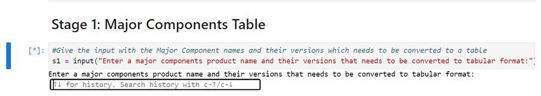
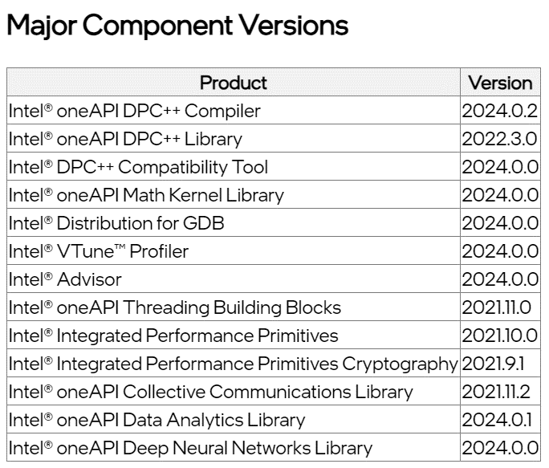
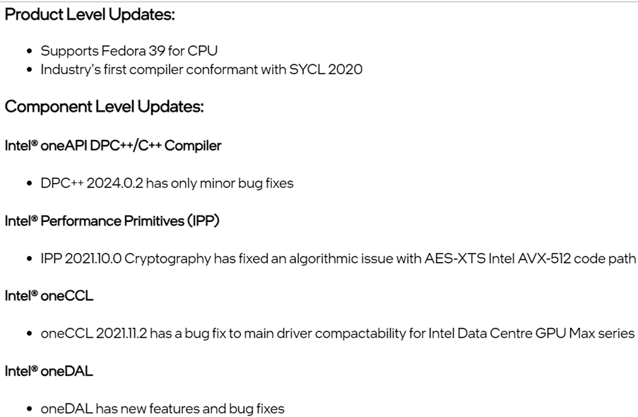

# Generating Latest Release Notes using GenAI

This GenAI-powered document creation tool streamlines the process of generating release notes of Intel products. It accepts the latest features and generates the output in desired format.

| Area                     | Description
|:---                      |:---
| What you will learn      | Usage of Hugging Face Transformers for Generating Text as per the given prompt
| Time to complete         | < 15 minutes*

# Pre-requisites:

| Optimized for                     | Description
|:---                               |:---
| OS                                | Ubuntu* 20.04
| Hardware                          | Intel CPUs & GPUs
| Software                          | Intel® Extension for PyTorch 2.0*, PyTorch*, Hugging Face Transformers 4.38.1*, Jupyter Notebook, HTML.

## Technologies Used: 
<ul>
<li><b>PyTorch</b>: PyTorch is a popular open-source machine learning library used for various applications such as natural language processing, computer vision, and more. It provides a flexible framework for building and training neural networks. </li>

<li><b>Intel Extension for PyTorch (IPEX)</b>: Intel Extension for PyTorch is a set of extensions and optimizations for PyTorch aimed at improving performance, especially on Intel hardware platforms. It provides enhanced support for Intel-specific features like bfloat16 data type, enabling efficient execution on Intel processors.</li> 

<li><b>Transformers Library</b>: The Transformers library is a powerful tool for natural language processing (NLP) tasks, developed by Hugging Face. It offers pre-trained models and utilities for tasks such as text generation, language understanding, and translation. </li>

<li><b>HTML</b>:  HyperText Markup Language or HTML is the standard markup language for documents designed to be displayed in a web browser. It defines the content and structure of web content. </li> 
</ul>

# Key Implementations Details:
This example demonstrates a documentation creation tool using GenAI where a paragraph is provided as input & an output is generated as formatted List & Tables. This could be done in the below sequential way:
1. Importing a Pre-trained model followed by Pipeline Creation with required parameters.
2. Performing Prompt Engineering to convert a input text into a well-formatted Table.
3. Performing Prompt engineering to convert a input text into a Formatted list.
4. Post completition of prompt engineering, resultant output is written to a HTML Page.

# Steps to Build:
1. Launch Jupyter Notebook & install all the necessary dependencies.
2. Open the ReleaseCrafters.ipynb & Run all the cells one by one.
3. While running the cells, provide input paragraphs to the prompt when popped up. Please check the below examples to understand the type of input.
   ## Example of an input to convert into a table:
   ### Input Data:
   'Intel® oneAPI DPC++ Compiler',2024.0.2,'Intel® oneAPI DPC++ Library', 2022.3.0,'Intel® DPC++ Compatibility Tool', 2024.0.0,'Intel® oneAPI Math Kernel Library', 2024.0.0,'Intel® Distribution for GDB', 2024.0.0,'Intel® VTune™ Profiler', 2024.0.0,'Intel® Advisor', 2024.0.0,'Intel® oneAPI Threading Building Blocks', 2021.11.0,'Intel® Integrated Performance Primitives', 2021.10.0,'Intel® Integrated Performance Primitives Cryptography', 2021.9.1,'Intel® oneAPI Collective Communications Library',2021.11.2,'Intel® oneAPI Data Analytics Library',2024.0.1,'Intel® oneAPI Deep Neural Networks Library'2024.0.0
   

   ### Expected Output:
   
   

   ## Example of an input to convert into a Formatted list:
   ### Input Data
   The release patch releases for different component has been included in this release.  Intel® oneAPI Base Toolkit 2024.1.0 now supports Fedora 39 for CPU. These patches are build of top of previous patches as required.  The Intel® oneAPI DPC++/C++ Compiler is the industry's first compiler conformant with SYCL 2020 allowing developers to write code once and run it on a  variety of different processors using standard C++ making developers more productive by reducing development time and effort. DPC++ 2024.0.2 has only minor bug fixes.  IPP 2021.10.0 Cryptography has fixed an algorithmic issue with AES-XTS Intel AVX-512 code path. oneCCL 2021.11.2 has a bug fix to main driver compactability for Intel Data Centre GPU Max series. oneDAL has new features and bug fixes.
  

### Expected Output:

  
   
   

 
